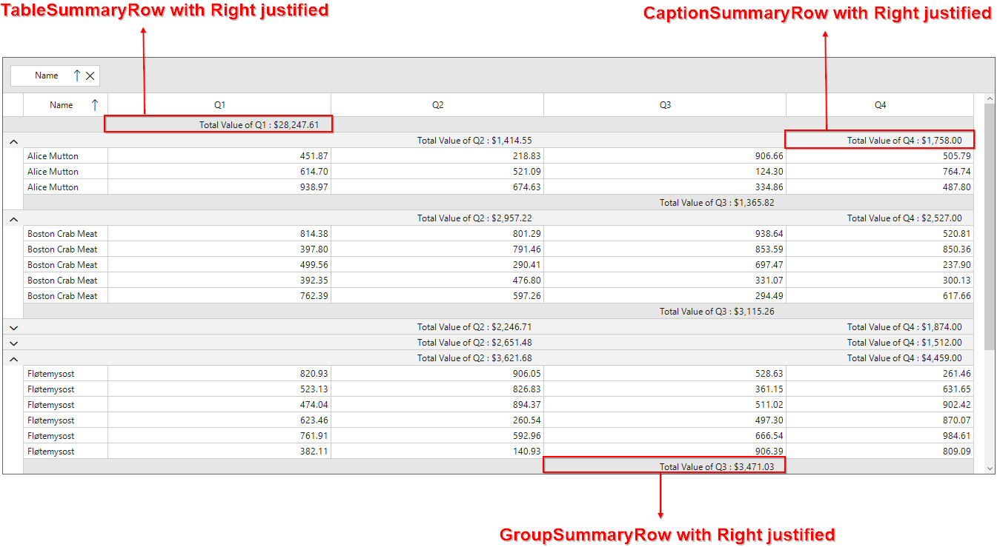

# How to right justify a Table ,Group and Caption summary column in WinForms DataGrid (SfDataGrid)?

## About the sample
This example illustrates how to right justify a Table ,Group and Caption summary column in WinForms DataGrid (SfDataGrid)

By default, [SfDataGrid](https://help.syncfusion.com/cr/windowsforms/Syncfusion.WinForms.DataGrid.SfDataGrid.html) shows the [TableSummaryRow](https://help.syncfusion.com/cr/windowsforms/Syncfusion.WinForms.DataGrid.GridTableSummaryRow.html) in Left Alignment. You can change [TableSummaryRow](https://help.syncfusion.com/cr/windowsforms/Syncfusion.WinForms.DataGrid.GridTableSummaryRow.html) alignment by customization the HorizontalAligment property of [SfDataGrid.Style.TableSummaryRowStyle](https://help.syncfusion.com/cr/windowsforms/Syncfusion.WinForms.DataGrid.Styles.DataGridStyle.html#Syncfusion_WinForms_DataGrid_Styles_DataGridStyle_TableSummaryRowStyle) property. The [TableSummaryRowStyle](https://help.syncfusion.com/cr/windowsforms/Syncfusion.WinForms.DataGrid.Styles.DataGridStyle.html#Syncfusion_WinForms_DataGrid_Styles_DataGridStyle_TableSummaryRowStyle) property contains all the settings that are needed for the table summary row appearance customization.

```C#

// justify the values to be right in the summary rows 
this.sfDataGrid.Style.TableSummaryRowStyle.HorizontalAlignment = HorizontalAlignment.Right;
this.sfDataGrid.Style.GroupSummaryRowStyle.HorizontalAlignment = HorizontalAlignment.Right;            
this.sfDataGrid.Style.CaptionSummaryRowStyle.HorizontalAlignment = HorizontalAlignment.Right;


```

#### Note: GroupSummaryRowStyle and CaptionSummaryRowStyle horizontal alignment are customized like the horizontal alignment customization of TableSummaryRowStyle

The following screenshot shows the right justify of Table, Group and Caption summary column in SfDataGrid,



## Requirements to run the demo
Visual Studio 2015 and above versions


